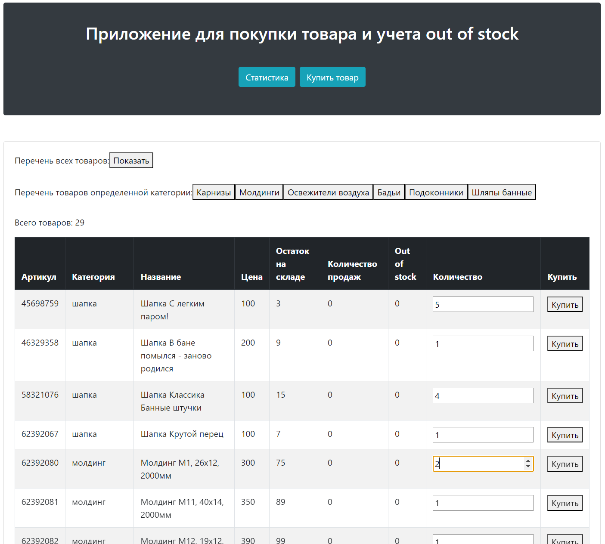
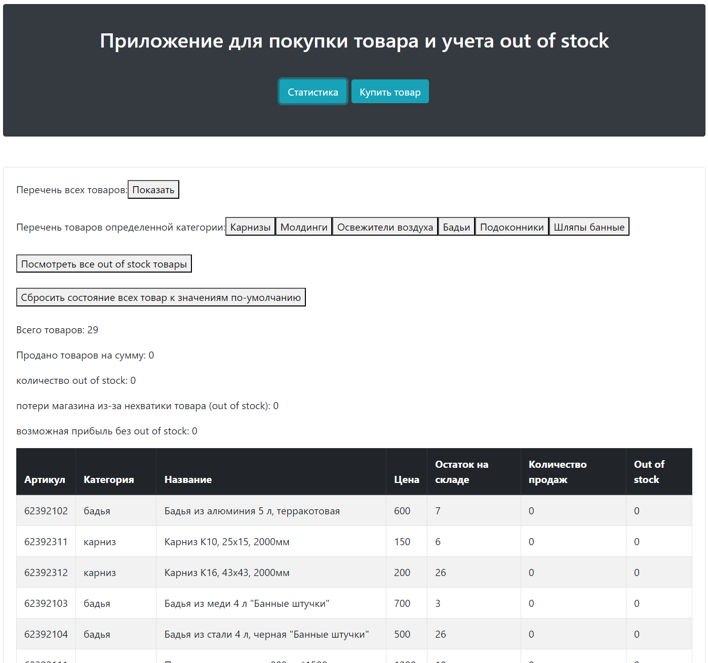

# residue-monitoring-system
Приложение по подсчету out of stock товаров и вычислению потенциальной прибыли магазина

# Residue Monitoring System

В приложении доступен некоторый список товаров, которые можно купить.
Если не хватает товара на остатке для покупке, то количество, которое хотел купить покупатель записывается в out of stock
для этого товара.

Доступна страничка со статистикой где можно посмотреть общую выручку, возможную выручку, если бы не закончился товар.
Также на странице статистики можно сбросить состояние всех товаров к значению по-умолчанию





<br>

## Технологии и инструменты

- Java Spring: 
- PostgreSQL: 
- Angular: 

<br>

### Установите необходимые зависимости и настройки:

Убедитесь, что у вас установлена Java Development Kit (JDK).
Создайте базу данных PostgreSQL с именем residue_monitoring_system. 

Пользователь базы данных:
* login: postgres
* pass: 12345

Измените файл application.properties и укажите настройки подключения к вашей базе данных PostgreSQL.


```
spring.datasource.url=jdbc:postgresql://localhost:5432/residue_monitoring_system
spring.datasource.username=postgres
spring.datasource.password=12345
```

